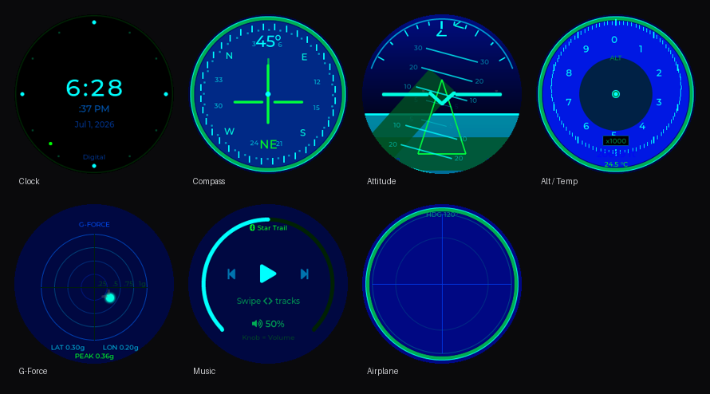
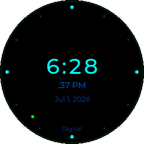
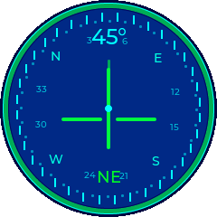
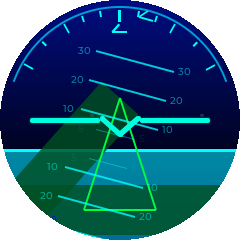
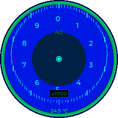
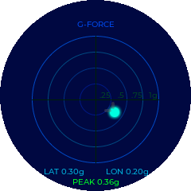
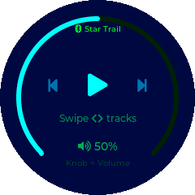
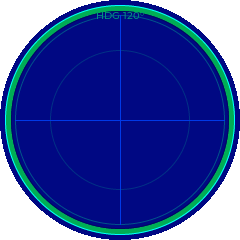

# Star Trail Firmware v9.0

## Overview
ESP32-S3 automotive instrument cluster firmware with LVGL display.  
240×240 round LCD | MPU9250 IMU | BME280 | BLE | WiFi | OTA

## Widget Preview
Rendered from the actual firmware widget code via the LVGL PC simulator
(`../simulator`), 240×240 round display:



| | | | |
|:-:|:-:|:-:|:-:|
|  |  |  |  |
| Clock | Compass | Attitude | Alt / Temp |
|  |  |  | |
| G-Force | Music | Airplane | |

### Running the simulator yourself
The same widget code compiles and runs on a PC via SDL2 + LVGL (no hardware
needed), so you can preview and iterate on widgets fast.

**Requirements:** CMake, Ninja, a C++17 compiler (MSVC/GCC/Clang), and SDL2
(e.g. `vcpkg install sdl2`). LVGL v8.3.9 is fetched automatically.

```bash
# Windows (MSVC + vcpkg) — helper script:
simulator/build_sim.bat
simulator/build/simulator.exe            # interactive: arrow keys cycle widgets

# Any platform (manual):
cmake -S simulator -B simulator/build -G Ninja \
  -DCMAKE_TOOLCHAIN_FILE=<vcpkg>/scripts/buildsystems/vcpkg.cmake
cmake --build simulator/build

# Regenerate the preview images above (headless, no window needed):
simulator/build/simulator --shots simulator/shots
```
Interactive controls: ←/→ (or ↑/↓) cycle widgets, Esc quits.

## Hardware
| Pin | Function |
|-----|----------|
| SDA / SCL | 11 / 12 (I²C — MPU9250 + BME280) |
| LCD | SPI via ST7789V (see `display.cpp`) |
| NeoPixel LED | GPIO 18 |
| Rotary Encoder | A=5, B=6, BTN=7 |

## Features

### Widgets (rotary encoder to switch)
| Widget | Description |
|--------|-------------|
| **Attitude Indicator** | ICAO-standard AI: sky/ground, pitch ladder, bank ticks ±10/20/30/45/60° |
| **Compass** | Digital compass with heading in degrees |
| **Altitude/Temp** | Temperature (°C) + altitude (feet ASL) |
| **G-Force** | Real-time accelerometer display |
| **Clock** | 3 faces: Digital, Analog, Minimal (long-press to switch face) |
| **Music** | BLE media controller (play/pause/next/prev) |
| **Sensor View** | Raw sensor data readout |
| **System Info** | CPU, memory, uptime, WiFi status |
| **Calibration** | Magnetometer figure-8 calibration wizard |
| **LED Color** | NeoPixel color picker |
| **Custom** | User-designed face pushed from the companion app (see below) |

### Custom Widgets (designer pipeline)
Design your own cluster face in the companion app's **Designer** tab — drag
gauges, value readouts, text, bars, icons, and shapes onto a 240×240 canvas,
bind elements to live sensors (heading, pitch, roll, temp, altitude, pressure),
then push to the device. The layout is a small JSON document (shared contract in
`custom_widget.h`) rendered on-device by a generic LVGL interpreter — no
per-design firmware. Transport: **BLE primary** (chunked writes on the custom
layout characteristic), **WiFi fallback** (`POST /api/custom_layout`). The active
layout is stored on SPIFFS (`/custom/layout.json`) and survives reboot.

### Splash Screens
Configurable in `/splash_theme.txt` on SPIFFS:
- `star_trail` — Default animated star trail
- `vw` — Volkswagen logo
- `illuminati` — Inverted eye animation with zoom

### Web Dashboard
Access at `http://<device-ip>/` (printed on serial at boot)

| Tab | Features |
|-----|----------|
| Sensors | Live IMU, temp, altitude, pressure, magnetometer |
| Serial | Remote serial monitor (ring buffer) |
| WiFi | SSID, IP, RSSI, NTP sync |
| BLE | Media keys and notification toggles |
| Music | Remote play/pause/next/prev + volume |
| Update | OTA firmware upload (.bin) |
| System | Uptime, heap, brightness control, reboot |

Custom layout push endpoint: `POST /api/custom_layout` (raw JSON body).

### OTA Updates
1. Open `http://<device-ip>/` in browser
2. Go to **Update** tab
3. Select `.bin` file → Upload

### Altitude
3-tier sea-level pressure source:
1. OpenWeatherMap API (if configured in `config.h`)
2. BME280 calibration from known 920m Bangalore elevation
3. Standard 1013.25 hPa fallback

## File Structure
```
BenzCluster/
├── BenzCluster.ino       # Main entry, widget switching, setup/loop
├── config.h              # WiFi, API keys, pin definitions
├── display.cpp/h         # ST7789V display driver + LVGL init
├── sensors.cpp/h         # MPU9250 + AK8963 + BME280 driver
├── attitude.cpp/h        # ICAO attitude indicator widget
├── compass.cpp/h         # Digital compass widget
├── alttemp.cpp/h         # Altitude + temperature widget
├── clock.cpp/h           # 3-face clock (Digital/Analog/Minimal)
├── gforce.cpp/h          # G-force display widget
├── music.cpp/h           # BLE music remote widget
├── sensorview.cpp/h      # Raw sensor data widget
├── systemview.cpp/h      # System info widget
├── calibration.cpp/h     # Magnetometer calibration logic
├── calibration_widget.cpp/h  # Calibration UI
├── custom_widget.cpp/h   # Dynamic LVGL renderer + JSON layout parser (shared)
├── custom_screen.cpp/h   # 'Custom' widget screen hosting a pushed layout
├── ledcolor.cpp/h        # NeoPixel color widget
├── leds.cpp/h            # LED strip driver
├── splash.cpp/h          # Splash screen (3 themes)
├── ota_update.cpp/h      # Web dashboard + OTA + serial logger
├── wifi_manager.cpp/h    # WiFi, NTP, weather API
├── ble_media.cpp/h       # BLE HID media keys
├── ble_notify.cpp/h      # BLE notifications
├── ota_upload.py          # CLI OTA upload script
├── partitions.csv        # Flash partition table (3M app + 9M FAT)
├── benz_logo.c/h         # Benz splash image data
├── vw_logo.h             # VW splash image data
├── illuminati_logo.h     # Illuminati splash image data
├── illuminati_text.h     # Illuminati text image data
└── build/                # Compiled binaries
    └── BenzCluster.ino.bin   # Ready-to-flash firmware
```

## Configuration (`config.h`)
```cpp
#define WIFI_SSID       "your-ssid"
#define WIFI_PASSWORD   "your-password"
#define WEATHER_API_KEY "openweathermap-key"  // optional
#define WEATHER_LAT     "12.97"               // Bangalore
#define WEATHER_LON     "77.59"
```

## Build & Flash
```bash
# Compile
arduino-cli compile -b esp32:esp32:esp32s3:PartitionScheme=app3M_fat9M_16MB,FlashSize=16M

# Flash via serial
arduino-cli upload -b esp32:esp32:esp32s3 -p COM9

# Flash via OTA (browser)
# Open http://<device-ip>/ → Update tab → Upload .bin
```

## Dependencies
- Arduino Core for ESP32 ≥ 2.0.14
- LVGL 8.3.x
- Adafruit NeoPixel
- ArduinoOTA (built-in)

## Build Info
- **Size:** 1.80 MB (57% of 3 MB partition)
- **Version:** 9.0
- **Date:** 2026-02-27
