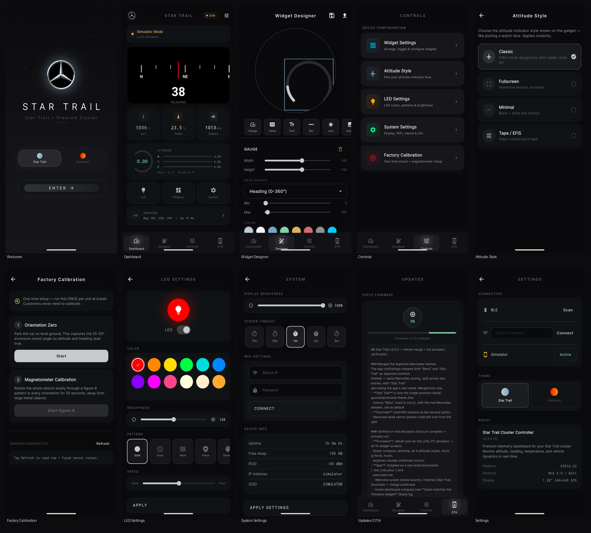

# Star Trail Instrument Cluster

A premium digital instrument cluster for the **CrowPanel 1.28" Round ESP32-S3 Display** — a complete automotive HUD replacement with a companion mobile app.

## Screenshots

### Firmware — LVGL PC simulator (`simulator/`)
Rendered from the actual firmware widget code (not mockups) — see [`BenzCluster/docs/widgets/`](BenzCluster/docs/widgets/) and the [firmware README](BenzCluster/README.md#widget-preview) for the full breakdown.


### Companion app — Android emulator (`star_trail_emu`)
Captured live on a real Android emulator, not simulated screenshots — every screen shown is the actual installed release build (v2.0.2) running end to end, including a live call to the public GitHub API on the Updates screen.



| Screen | Description |
|--------|-------------|
| [Welcome](docs/screenshots/01_welcome.png) | Theme picker (Star Trail chrome / Illuminati) + entry point |
| [Dashboard](docs/screenshots/04_dashboard.png) | Live telemetry — linear compass matching the firmware widget exactly, alt/temp/pressure, G-force |
| [Widget Designer](docs/screenshots/06_designer.png) | Drag-and-drop custom widget layout editor, pushes straight to the device |
| [Controls](docs/screenshots/07_controls.png) | Device configuration menu |
| [Attitude Style](docs/screenshots/08_attitude_style.png) | Pick the attitude-indicator face shown on the gadget, like a watch face |
| [Factory Calibration](docs/screenshots/09_factory_cal.png) | One-time installer wizard — orientation zero + magnetometer figure-8 |
| [LED Settings](docs/screenshots/11_led_settings.png) | Color, brightness, and pattern control for the 5 NeoPixels |
| [System Settings](docs/screenshots/12_system_settings.png) | Display brightness, screen timeout, WiFi, device diagnostics |
| [Updates (OTA)](docs/screenshots/13_ota.png) | One-tap firmware update straight from a GitHub release, plus app auto-update |
| [Settings](docs/screenshots/14_config.png) | Connection (BLE/WiFi/Simulator), theme, and app info |

```
ESP32-S3 (BenzCluster firmware)    ◄── BLE/WiFi ──►    Flutter App (star_trail)
├── 7 LVGL widgets on 240x240 GC9A01              ├── Real-time dashboard mirror
├── MPU9250 9-DOF + BME280 sensors                ├── Widget/LED/System controls
├── 5x NeoPixel status LEDs                       ├── OTA firmware updates
├── BLE HID media keys                            └── BLE scan + WiFi connect
├── BLE phone notifications
├── WiFi web dashboard + REST API
└── Rotary encoder navigation
```

## Features

### Hardware
- **Display:** 1.28" round GC9A01 (240x240) SPI display
- **Sensors:** MPU6050 (accelerometer + gyroscope), QMC5883L (magnetometer), BME280 (temperature, pressure, altitude)
- **Input:** Rotary encoder with push button, capacitive touch (CST816D)
- **Lighting:** 5 individually addressable NeoPixel LEDs
- **Connectivity:** WiFi (ESP32-S3), BLE (NimBLE stack)

### Firmware (BenzCluster)
- 8 swipeable LVGL widgets: **Clock, Compass, Attitude Indicator, Altitude/Temperature, G-Force, Music Remote, Airplane, Custom**
- Linear scrolling compass with true-north heading (tilt-compensated, hard/soft-iron corrected)
- 4 selectable attitude-indicator styles (Classic ICAO, Fullscreen, Minimal, Tape/EFIS), switchable from the app like a watch face
- One-time factory calibration (mount-tilt orientation zero + magnetometer figure-8) — end customers never calibrate
- Custom widget designer: user-designed layouts pushed from the app render live on-device
- BLE HID media control (play/pause/next/prev/volume)
- WiFi web dashboard with REST API on port 80
- OTA firmware updates over WiFi (pushed automatically from the app, or manual .bin upload)
- Rotary encoder for brightness, volume, widget navigation
- 3-second encoder hold for system overlay (sensor viewer, system info, calibration)

### Companion App (star_trail)
- Real-time dashboard mirror — widgets match the firmware exactly (same linear compass, same colours)
- 2 themes: **Star Trail** (premium black/gunmetal/chrome, real Mercedes emblem, default), **Illuminati** (VW red)
- Drag-and-drop widget designer that pushes custom layouts straight to the device
- Attitude style picker and factory calibration wizard
- Widget configuration (enable/disable, reorder, swipe direction, knob mode)
- LED control (color picker, patterns, brightness, speed)
- System settings (display brightness, screen timeout, WiFi config, device info)
- One-tap firmware update straight from a GitHub release (manual .bin upload kept as a fallback)
- App auto-update via GitHub Releases (checks for new APK versions, downloads & installs)
- Connection via BLE scan, WiFi IP, or built-in simulator mode

## Quick Start

### Prerequisites
- CrowPanel 1.28" ESP32-S3 Round Display
- Arduino IDE (with ESP32-S3 board support) or PlatformIO
- Flutter SDK 3.12.2+ (for companion app)
- USB-C cable

### Flash Firmware (Arduino IDE)
1. Open `BenzCluster/BenzCluster.ino` in Arduino IDE
2. Install required libraries:
   - Adafruit NeoPixel 1.15.3+
   - ArduinoJson 7.4.2+
   - LovyanGFX 1.2.19+
   - lvgl 8.3.11
   - NimBLE-Arduino 2.3.7+
   - ESPAsyncWebServer 3.1.0+
3. Board: **ESP32-S3 Dev Module**
4. Partition Scheme: **Huge APP (3MB No OTA/1MB SPIFFS)** (or use `partitions.csv` for dual OTA)
5. Select the correct COM port
6. Click **Upload**

### Build Companion App
```bash
cd flutter_app/

# Analyze for errors
flutter analyze

# Debug APK
flutter build apk --debug

# Release APK
flutter build apk --release

# Or run on connected device
flutter run
```

The release APK will be at `flutter_app/build/app/outputs/flutter-apk/app-release.apk`.

### OTA Update (from CLI)
```bash
python BenzCluster/ota_upload.py --ip 192.168.x.x --bin build/BenzCluster.ino.bin
```

## Architecture

### Communication
The ESP32-S3 runs a WiFi access point (or connects to your network) with a REST API server on port 80, and simultaneously acts as a BLE peripheral broadcasting sensor data and accepting commands. The Flutter app connects via either channel.

### REST API Endpoints
| Endpoint | Method | Params | Description |
|----------|--------|--------|-------------|
| `/api/status` | GET | — | Full sensor + system JSON |
| `/api/led` | GET | `state`, `color`, `brightness`, `pattern`, `speed` | LED control |
| `/api/brightness` | GET | `v` | Display brightness |
| `/api/timeout` | GET | `v` | Screen timeout seconds |
| `/api/music` | GET | `cmd` | Media commands (play/next/prev/vol_up/vol_down) |
| `/api/widgets` | GET | `enabled`, `order`, `swipe`, `knob` | Widget configuration |
| `/api/app-version` | GET | — | Returns Flutter app version info for auto-update |
| `/reboot` | GET | — | Reboot device |
| `/update` | POST | firmware.bin | OTA firmware update |

### BLE Protocol
- **Notify characteristic:** Broadcasts JSON with `heading`, `pitch`, `roll`, `temp`, `alt_ft`, `pressure`, accelerometer/magnetometer raw data, uptime, heap, RSSI, IP, SSID
- **Write characteristic:** Accepts commands matching the REST API path format

### Widget System
The firmware renders 7 widgets swipeable on the round display. Each widget is a separate LVGL screen created in its own `.cpp`/`.h` file pair. The companion app mirrors these with `CustomPainter` implementations.

## Hardware Pinout

| Component | Interface | Pins |
|-----------|-----------|------|
| GC9A01 Display | SPI | SCLK=10, MOSI=11, DC=3, CS=9, RST=14, BL=46 |
| CST816D Touch | I2C (Wire1) | SDA=6, SCL=7, RST=13, INT=5 |
| MPU9250 | I2C (Wire) | SDA=38, SCL=39, ADDR=0x68 |
| QMC5883L | I2C (Wire) | ADDR=0x0D |
| BME280 | I2C (Wire) | ADDR=0x76 |
| Rotary Encoder | GPIO | A=45, B=42, SW=41 |
| NeoPixel | GPIO | PIN=48, COUNT=5 |

## Project Structure

```
CrowPanel_Repo/
├── BenzCluster/          ESP32-S3 firmware (Arduino sketch)
├── flutter_app/          Flutter companion app (star_trail)
├── Datasheet/            Component datasheets
├── Eagle_SCH&PCB/        Circuit schematic and PCB layout
├── 3D file/              Enclosure STEP model
├── simulator/            PC LVGL simulator
├── factory_firmware/     Pre-compiled factory binaries + flash tool
├── factory_soucecode/    Factory SquareLine Studio project
├── example/              Example sketches and third-party libraries
└── SensorDiag/           Standalone sensor diagnostic tool
```

## CI/CD & Release

### Building for Release

**Firmware**
```bash
arduino-cli compile --fqbn esp32:esp32:esp32s3 --partitions-scheme huge_app BenzCluster/
```

**Flutter APK**
```bash
cd flutter_app/
flutter build apk --release --build-name=2.0.2 --build-number=5
```

Release APK: `flutter_app/build/app/outputs/flutter-apk/app-release.apk` (~54.7MB)
Debug APK: `flutter_app/build/app/outputs/flutter-apk/app-debug.apk`

### Creating a GitHub Release
1. Build firmware and APK (commands above)
2. Create a GitHub Release with tag `vX.Y.Z` (match `--build-name`), **repo must be public** — GitHub's REST API returns 404 for unauthenticated release lookups on private repos, which silently breaks both the app and firmware auto-update
3. Upload `app-release.apk` AND the firmware `.bin` as release assets — the app derives both the app update and the firmware update from the same release
4. `githubRepo` in `lib/services/update_service.dart` already points at this repo
5. Users' apps auto-detect the new app version on next launch; the Updates screen offers one-tap firmware push whenever a new `.bin` is published

### Auto-Update Flow
- `UpdateService` checks the GitHub Releases API once per launch, deriving both app-APK and firmware-.bin info from the same release
- Compares versions semantically against the installed app version
- App: downloads the APK to temp storage and opens it via Android FileProvider (requires Android 7+)
- Firmware: downloads the `.bin` into memory and pushes it to the device over WiFi automatically (`POST /update`) — no manual file picking required; manual upload remains as a fallback

### Verification
- `flutter analyze` — 0 issues
- `flutter test` — 23 tests pass
- Firmware: compiles to ~2.03MB (64% of the 3MB app partition)
- Verified live: LVGL PC simulator (all 10 widget screens) + a real Android emulator (all app screens, including a live GitHub API round-trip on the Updates screen) — see Screenshots above

## License

Private project. All rights reserved.
